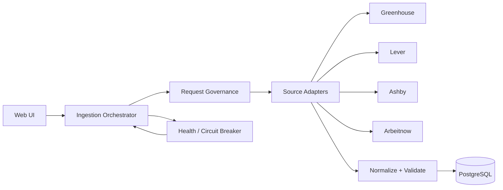
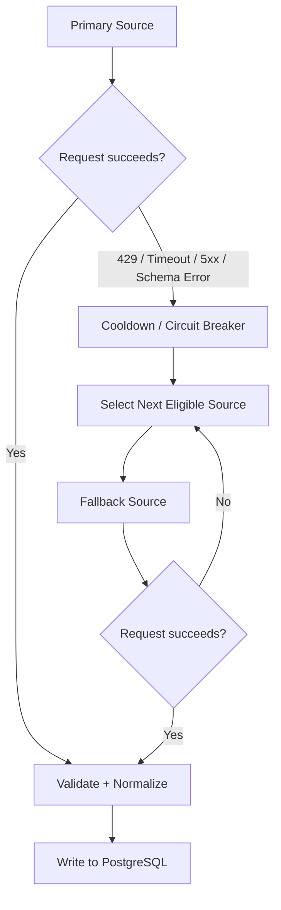

# jobPulse — Architecture & Ingestion Decisions

This document outlines the core technical decisions, trade-offs, verification steps, and operational rules governing the jobPulse multi-source ingestion platform.

---

## 1. Why this ingestion strategy?

The obvious alternative was browser-based scraping of restrictive job platforms. We rejected that for the live implementation because it adds brittle browser automation, CAPTCHA and fingerprinting concerns, higher operational cost, and a direct risk of violating platform access restrictions. The assignment also explicitly permits a low-risk public job source or a controlled sandbox.

Instead, jobPulse uses source adapters for permitted public ATS/feed endpoints, with a common normalization layer and a resilient orchestrator. Requests are governed with pacing, per-source budgets, and bounded concurrency. A 429, timeout, schema failure, or restriction moves the source into the appropriate health/cooldown state and the orchestrator falls back to another eligible source. This gives us a real end-to-end ingestion pipeline while keeping the live demo within the assignment's scope guardrail.

### System Architecture Overview



### Ingestion & Failover Flow



---

## 2. Time-limit trade-off

Under the time limit, we prioritized a reliable multi-source ingestion and resilience path over building a full browser-scraping stack. We also chose not to implement identity/proxy rotation or anti-bot evasion; when a source becomes restrictive, jobPulse stops or cools it down and falls back rather than trying to defeat the restriction.

With a real week, I would improve source coverage and observability, add more production-level tests and deployment hardening, and deepen the adapter contracts so each source can independently evolve without affecting the ingestion engine. I would still keep restricted-source access behind explicit permission and technical boundaries rather than bypassing anti-bot controls.

---

## 3. AI use and personal verification

I used AI tools, including Antigravity, to accelerate project scaffolding, implementation, UI work, and debugging. I did not treat generated output as automatically correct. I personally ran the application, triggered real ingestion, checked the PostgreSQL data, verified search and job links, exercised the failure-simulation flows, and inspected source-health and ingestion-count behavior. I also identified and corrected issues during testing, including misleading ingestion counts, source-health/fallback behavior, and the distinction between total jobs stored and jobs fetched in a particular run.

---

## 4. Architectural Rules & Backend Guarantees

### A. Track Every Source Attempt
Every source attempted during a resilient ingestion run produces a detailed result in the `attemptedSources` list:
```json
{
  "source": "greenhouse",
  "status": "rate_limited",
  "jobsFetched": 0,
  "jobsInserted": 0,
  "jobsUpdated": 0,
  "jobsSkipped": 0,
  "error": "HTTP 429"
}
```

### B. Final Ingestion Result & Summary Metrics
The orchestrator returns a clean response separating run metrics from total database storage:
```json
{
  "status": "success",
  "sourceUsed": "ashby",
  "attemptedSources": [
    {
      "source": "greenhouse",
      "status": "rate_limited",
      "jobsFetched": 0,
      "jobsInserted": 0,
      "jobsUpdated": 0,
      "jobsSkipped": 0
    },
    {
      "source": "lever",
      "status": "timeout",
      "jobsFetched": 0,
      "jobsInserted": 0,
      "jobsUpdated": 0,
      "jobsSkipped": 0
    },
    {
      "source": "ashby",
      "status": "success",
      "jobsFetched": 231,
      "jobsInserted": 43,
      "jobsUpdated": 12,
      "jobsSkipped": 176
    }
  ],
  "summary": {
    "jobsFetched": 231,
    "jobsInserted": 43,
    "jobsUpdated": 12,
    "jobsSkipped": 176,
    "totalJobsStored": 754
  }
}
```

> **Metric Rule**: `totalJobsStored` represents total PostgreSQL records (`prisma.job.count()`) and is never substituted for `jobsFetched`.

### C. Source Health State Machine & Cooldowns
Supported health states:
- `HEALTHY`: Normal operations.
- `DEGRADED`: Non-fatal issues or minor transient errors.
- `RATE_LIMITED`: HTTP 429 received; active cooldown period set using `Retry-After` header or bounded exponential backoff.
- `UNAVAILABLE`: Repeated failures or circuit breaker OPEN.
- `SCHEMA_ERROR`: Response schema drift or malformed JSON.

### D. Rate-Limited Source Selection
When a source has status `RATE_LIMITED` and `cooldownUntil > now`, the orchestrator filters it out during source selection. The backend does not attempt requests against cooling sources.

### E. Stop Sequence on Success
In failover mode, when a primary source succeeds (e.g. `Greenhouse -> SUCCESS`), the orchestrator stops immediately and marks unattempted fallback sources as `NOT ATTEMPTED` (`Primary source succeeded`).

### F. Data Protection on Failures
If a source fails due to 429, 500, timeout, or malformed schema, existing PostgreSQL job records are untouched. No stale deletions occur during partial or failed runs.

---

## 5. Verified Test Scenarios & Metrics

Below are the empirical verification results recorded from running the test suite:

### Test A — Healthy Greenhouse Primary Run
- **Config**: Default healthy environment.
- **Attempted**: `Greenhouse` (SUCCESS)
- **Result**: `sourceUsed = greenhouse`, `jobsFetched = 578`, `jobsDeleted = 0`. Fallback sources skipped (`not_attempted`).

### Test B — Greenhouse Rate Limited (HTTP 429)
- **Config**: `Greenhouse = 429` override.
- **Attempted**: `Greenhouse` (429) ➔ `Lever` (SUCCESS).
- **Result**: `sourceUsed = lever`, `jobsFetched = 99`, `jobsDeleted = 0`. Greenhouse placed in 30s rate-limit cooldown.

### Test C — Multiple Failures (429 & Timeout)
- **Config**: `Greenhouse = 429`, `Lever = timeout`.
- **Attempted**: `Greenhouse` (429) ➔ `Lever` (504 Timeout) ➔ `Ashby` (SUCCESS).
- **Result**: `sourceUsed = ashby`, `jobsFetched = 24`, `jobsDeleted = 0`.

### Test D — Skipping Rate-Limited Sources During Cooldown
- **Config**: Run ingestion while Greenhouse and Lever are in active cooldowns.
- **Attempted**: `Greenhouse` (Skipped: Cooldown) ➔ `Lever` (Skipped: Cooldown) ➔ `Ashby` (SUCCESS).
- **Result**: `sourceUsed = ashby`. Backend avoided calling cooling sources.

### Test E — All Sources Unavailable
- **Config**: `Greenhouse = 429`, `Lever = 500`, `Ashby = timeout`, `Arbeitnow = 403`.
- **Attempted**: All 4 sources failed.
- **Result**: `status = failed`, `reason = ALL_SOURCES_UNAVAILABLE`, `jobsFetched = 0`, `jobsDeleted = 0`. PostgreSQL data preserved with 0 deletions.
